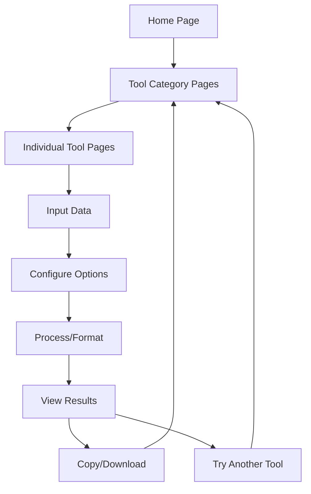

# FreeFormatter Clone - Product Requirements Document

## 1. Product Overview
A comprehensive web-based developer tools platform providing free online utilities for formatting, validation, conversion, encoding, and code manipulation with an artistic black and white UI design.

The platform serves developers by offering essential tools for data transformation, code beautification, validation, and utility functions in a single, accessible interface. Target market includes web developers, software engineers, and technical professionals who need quick access to formatting and conversion tools.

## 2. Core Features

### 2.1 User Roles
| Role | Registration Method | Core Permissions |
|------|---------------------|------------------|
| Default User | Direct access (no registration) | Can access all formatting, validation, and conversion tools |

### 2.2 Feature Module
Our FreeFormatter clone consists of the following main pages:
1. **Home page**: navigation menu, tool categories, featured tools showcase, search functionality.
2. **JSON Tools page**: JSON formatter/beautifier, JSON validator, JSON escape/unescape utilities.
3. **XML/HTML Tools page**: XML formatter, HTML formatter, XML validator, HTML validator, XPath tester.
4. **Code Tools page**: SQL formatter, JavaScript beautifier/minifier, CSS beautifier/minifier.
5. **Converter Tools page**: XML to JSON, JSON to XML, CSV converters, YAML converters, timestamp converter.
6. **Encoder/Crypto Tools page**: URL encoder/decoder, Base64 encoder/decoder, hash generators, QR code generator.
7. **Utility Tools page**: string utilities, regex tester, credit card validator, Lorem Ipsum generator.

### 2.3 Page Details

| Page Name | Module Name | Feature description |
|-----------|-------------|---------------------|
| Home page | Navigation Menu | Display categorized tool links with artistic black/white design, search bar for quick tool access |
| Home page | Featured Tools | Showcase most popular tools with preview functionality and direct access buttons |
| Home page | Tool Categories | Organize tools into Formatters, Validators, Converters, Encoders, Minifiers, Utilities sections |
| JSON Tools page | JSON Formatter | Format JSON with multiple indentation options (2/3/4 spaces, compact, tab), syntax highlighting, tree view |
| JSON Tools page | JSON Validator | Validate JSON against RFC 4627, strict/lenient modes, error reporting with line numbers |
| JSON Tools page | JSON Escape | Escape/unescape JSON strings, handle special characters, copy-paste and file upload support |
| XML/HTML Tools page | XML Formatter | Format XML with indentation options, syntax highlighting, collapsible tree structure |
| XML/HTML Tools page | HTML Formatter | Beautify HTML code with proper indentation, color syntax highlighting |
| XML/HTML Tools page | XML Validator | Validate XML against XSD schemas, well-formedness checking, detailed error reporting |
| XML/HTML Tools page | HTML Validator | Check HTML compliance with W3C standards, tag validation, attribute checking |
| XML/HTML Tools page | XPath Tester | Execute XPath queries against XML documents, display matched results |
| Code Tools page | SQL Formatter | Format SQL queries with indentation, keyword case options, database-agnostic support |
| Code Tools page | JavaScript Tools | Beautify and minify JavaScript code, syntax highlighting, error detection |
| Code Tools page | CSS Tools | Format and minify CSS code, property organization, validation |
| Converter Tools page | Data Converters | Convert between XML/JSON, CSV to XML/JSON, YAML to JSON formats |
| Converter Tools page | Timestamp Converter | Convert epoch timestamps to readable dates, timezone support |
| Converter Tools page | File Encoding | Convert file encoding between different character sets |
| Encoder/Crypto Tools page | URL Tools | Encode/decode URLs, handle special characters and query parameters |
| Encoder/Crypto Tools page | Base64 Tools | Encode/decode Base64 strings, file upload support |
| Encoder/Crypto Tools page | Hash Generators | Generate MD5, SHA-256, SHA-512 hashes, HMAC generation |
| Encoder/Crypto Tools page | QR Code Generator | Create QR codes from text input, customizable size and format |
| Utility Tools page | String Utilities | String manipulation tools, case conversion, length calculation |
| Utility Tools page | Regex Tester | Test regular expressions with sample text, match highlighting |
| Utility Tools page | Credit Card Validator | Validate credit card numbers, generate test card numbers |
| Utility Tools page | Lorem Ipsum Generator | Generate placeholder text with customizable length and format |

## 3. Core Process

Main user operation flow:
1. User visits homepage and browses tool categories or uses search
2. User selects specific tool from category page
3. User inputs data via text area, file upload, or paste
4. User configures tool options (indentation, validation mode, etc.)
5. User executes tool function and views formatted/processed results
6. User copies results or downloads output file
7. User can navigate to other tools or return to homepage

## 4. User Interface Design

### 4.1 Design Style
- **Primary colors**: Pure black (#000000) and white (#FFFFFF)
- **Secondary colors**: Charcoal gray (#333333) and light gray (#F5F5F5)
- **Button style**: Minimalist rectangular buttons with subtle hover effects
- **Font**: Modern sans-serif (Inter or similar), 16px base size, 14px for labels
- **Layout style**: Clean grid-based layout with ample white space, card-based tool organization
- **Icon style**: Simple line icons in black, geometric shapes for visual hierarchy

### 4.2 Page Design Overview

| Page Name | Module Name | UI Elements |
|-----------|-------------|-------------|
| Home page | Navigation Menu | Black header bar with white text, horizontal menu items, search icon on right |
| Home page | Tool Categories | White cards with black borders, category icons, tool count badges |
| Home page | Featured Tools | Large cards with tool previews, black text on white background |
| JSON Tools page | Tool Interface | Split-pane layout: input textarea on left, output on right, black toolbar with white icons |
| XML/HTML Tools page | Formatter Interface | Tabbed interface for multiple tools, syntax highlighting in grayscale tones |
| Code Tools page | Editor Interface | Monaco-style editor with black/white theme, line numbers, folding controls |
| Converter Tools page | Conversion Interface | Source/target format selectors, bidirectional arrow icon, progress indicators |
| Encoder/Crypto Tools page | Processing Interface | Input/output sections with copy buttons, hash algorithm dropdown menus |
| Utility Tools page | Utility Interface | Form-based inputs with immediate preview, result highlighting in gray tones |

### 4.3 Responsiveness
Desktop-first responsive design with mobile adaptation. Touch-optimized controls for mobile devices, collapsible navigation menu, and stacked layout for smaller screens. Minimum supported width: 320px.